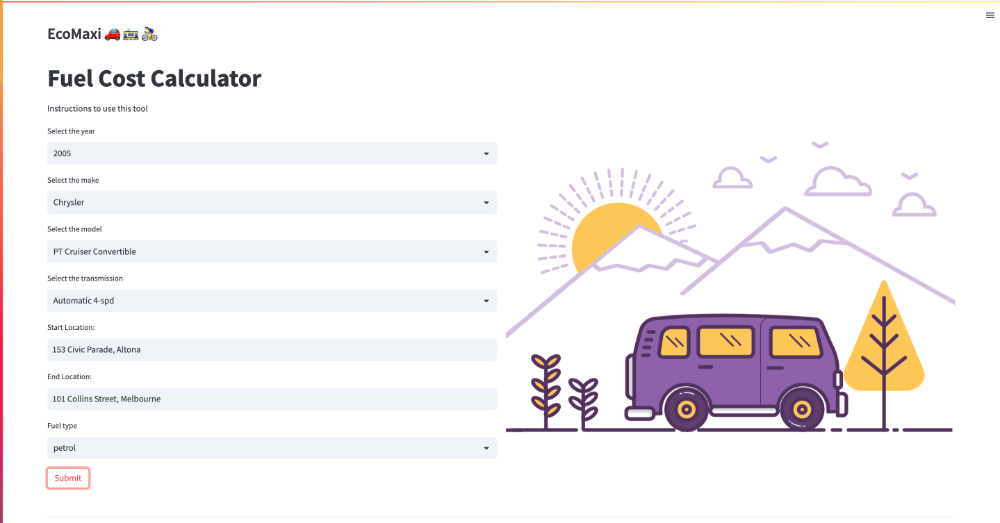

# Fintech-project-1 

## Project Overview
### Eco Maxi - Save money and the planet, one ride at a time.

EcoMaxi helps users calculate the cost of fuel when driving between destinations and provides alternative public transportation options. The app also calculates the total emissions saved by choosing these alternative methods of transportation. 

Additionally, EcoMaxi has a feature to compare and show the cheapest option between driving, public transportation and bike or walk. Users can also select a period of time and the app will visually display the total cash and emissions saved over that period, helping users make informed decisions about their transportation choices and ultimately reducing their environmental impact and saving them money. Overall, EcoMaxi promotes sustainable transportation, cost savings and a way to track and monitor the progress for the users.

## Technical environment
- **Google Distance Matrix API**: [Documentation](https://developers.google.com/maps/documentation/distance-matrix/distance-matrix)

## How to use this application
1. Clone this repository
2. Set the following API Keys in an env file:
*Google API*

3. Install the following dependencies:
```commandline
pip install streamlit
pip install streamlit-lottie
pip install requests
```
4. To run the application, go to the root directory and use:
```commandline
streamlit run app.py
```
## Application Usage

A user story for EcoMaxi might be as follows: Peter wants to take a trip from his home to his office which is 25 kms away. He usually drives but he wants to know if there are any other options that are more cost-effective and environmentally friendly. He opens up the EcoMaxi app and enters his starting point and destination. The app shows him the cost of driving petrol vehicles, electric vehicles, taking public transportation, and biking or walking. The app also shows him the total emissions saved and the money saved by choosing the different options. Peter is able to compare and choose the best option for him and make a more informed decision.

## How to use EcoMaxi 



1. Select Year of Vehicle from dropdown Menu    

2. Select Make of Vehicle from dropdown Menu

3. Select Model of Vehicle from dropdown Menu

4. Select Transmission Type from dropdown Menu

5. Input starting location into 'Start Location:' field. 

6. Input the end destination into 'End Location:' field. 

7. Select Fuel Type from the dropdown menu

8. Click on the Submit button

9. Information such as 'Total Fuel Cost', 'Fuel Efficiency', cO2 Emissions, Fuel Type and Drivetrain will display


## References
- Emoji cheat-sheet by [WebFX](https://www.webfx.com/tools/emoji-cheat-sheet/)
